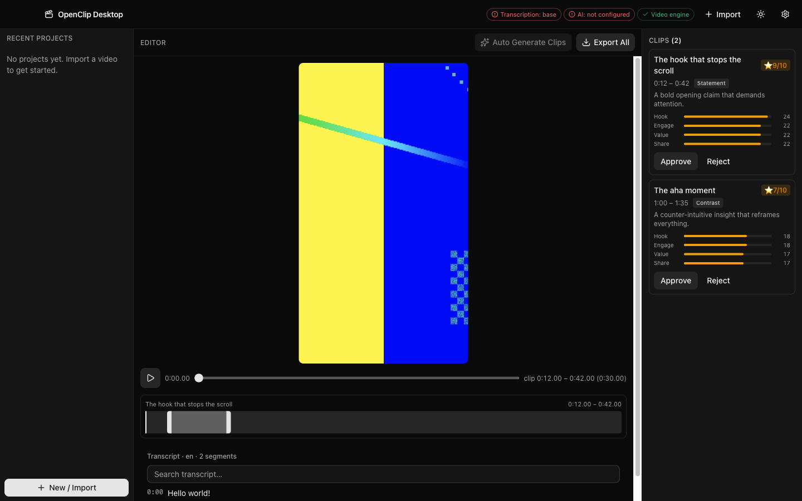
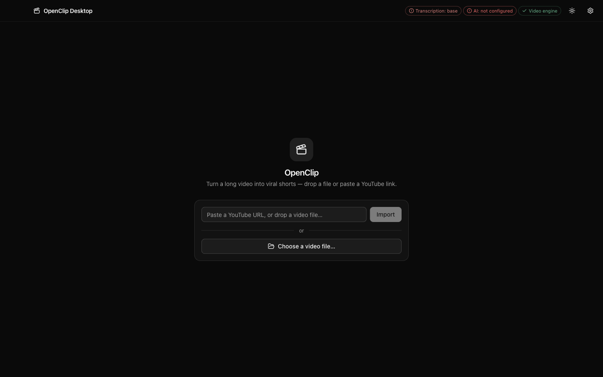

<div align="center">

# OpenClip Desktop

**Turn long videos into vertical short-form clips — on your own machine, with your own API key.**

Local-first · Bring-Your-Own-Key · macOS (Apple Silicon)

</div>



---

## Your video never leaves your computer

That is the whole point, so it goes first.

OpenClip transcribes **locally** with [whisper.cpp](https://github.com/ggml-org/whisper.cpp)
(Metal-accelerated on Apple Silicon) and cuts, reframes and burns captions
**locally** with FFmpeg. What is ever sent anywhere is **text** — the
**transcript** (segment-level text only) and the **project's title** — to
whichever LLM provider you configure, so it can pick the interesting moments.

- Your **video file** is never uploaded. Not to us, not to your LLM provider.
- Word-level timestamps stay on disk; they drive karaoke captions and are never transmitted.
- The **project's title** is sent as context (so the model knows what it's looking at) and
  **defaults to the filename you imported** — rename the project in the Dashboard before
  generating clips if that filename shouldn't leave this machine.
- There is no OpenClip account, no server, and no telemetry. There is nothing to sign up for.
- **You bring your own key.** It is stored with Electron's `safeStorage` (Keychain-backed)
  and the raw key never crosses the IPC boundary — the UI only ever sees `hasKey` and the last 4 characters.

If you have a NDA'd interview, an unreleased course, or a client's raw footage,
that is the difference between "can use this" and "cannot".

## How it works

```
 long video ──▶ ffprobe ──▶ ffmpeg (extract 16kHz WAV)
                                    │
                                    ▼
                       whisper.cpp  (LOCAL, word-level timestamps)
                                    │
                     transcript TEXT + project title
                                    ▼
                       your LLM  (OpenAI · Anthropic · Google · OpenRouter · Ollama)
                                    │
                       ranked clip candidates + scores
                                    ▼
   ffmpeg: cut ─▶ 9:16 reframe (face-tracked) ─▶ burn karaoke captions ─▶ .mp4
```

Everything above the LLM line and everything below it runs on your machine.
With **Ollama** as the provider, nothing leaves it at all.

## Quickstart

**1. Download.** Grab the latest `.dmg` from
[Releases](https://github.com/underworld14/openclip/releases), open it, and
drag **OpenClip** into **Applications**. No Node.js, no terminal, no build
step.

> The build is **not yet signed by an Apple Developer account** — macOS
> Gatekeeper will warn you the first time you open it ("OpenClip is damaged
> and can't be opened" or "the developer cannot be verified"). That is
> expected, not a broken download: see
> [Distributing a built app](#distributing-a-built-app-gatekeeper) below for
> the two ways past it (right-click → Open is usually enough).

- macOS on **Apple Silicon** only for now (see [Platform support](#platform-support))
- An API key for one of: OpenAI, Anthropic, Google, OpenRouter — or a local
  [Ollama](https://ollama.com) install, which needs no key

**Prefer to build from source instead** (or need to, e.g. to make your own
changes)? See [`CONTRIBUTING.md`](CONTRIBUTING.md) — `git clone`, `npm
install`, `npm run dev` gets you a hot-reloading dev build in a few minutes,
no packaging step required.

**Then, in the app:**

1. Open **Settings** (gear, top right) → pick your provider → paste your API key → pick a model.
   The readiness chips in the header turn green as each prerequisite is satisfied.
2. Still first run: OpenClip will offer to download a Whisper model (75 MB–2.9 GB
   depending on size). Models are **not** bundled; they download on demand to your
   app-data directory.
3. Drop a video onto the import panel, or paste a YouTube/video URL.
4. Wait for the local transcription, then hit **Auto Generate Clips**.
5. Review the candidates, trim on the timeline, and **Export**.



## What works today

Honest status. "Shipped" means it is wired end to end and covered by tests, not
that it is polished — see [Known rough edges](#known-rough-edges).

|     | Feature                                                                  | Status                                                         |
| --- | ------------------------------------------------------------------------ | -------------------------------------------------------------- |
| 🎙  | Local transcription (whisper.cpp, word-level timestamps, Metal/Core ML)  | **Shipped**                                                    |
| 🌐  | Import from file, drag-and-drop, or URL/YouTube (yt-dlp, no Python)      | **Shipped**                                                    |
| 🤖  | AI clip detection with per-clip scores, across 5 providers               | **Shipped**                                                    |
| 🖼  | Auto-reframe to 9:16 — ONNX YuNet face detection, speaker-following      | **Shipped**                                                    |
| 💬  | Burned-in karaoke captions (libass), 11 built-in templates               | **Shipped**                                                    |
| 😀  | AI emoji captions (own provider/model/key, separate from clip detection) | **Shipped**                                                    |
| ✂️  | Silence removal / jump cuts                                              | **Shipped**                                                    |
| 🎚  | Trim timeline with drag handles and I/O keyboard marks                   | **Shipped**                                                    |
| 📦  | Batch export with per-clip progress and cancel                           | **Shipped**                                                    |
| 🎨  | Brand kit (logo, colours, fonts)                                         | **Shipped**                                                    |
| 💾  | Local `.ocproj` projects, Zod-validated, with autosave                   | **Shipped**                                                    |
| 📐  | 9:16 / 1:1 / 4:5 / 16:9 output                                           | **Shipped** (crop only — no letterbox/pad yet)                 |
| 📝  | AI title/hashtag generation                                              | **Computed but never shown** — the UI surface is missing       |
| ✍️  | AI caption _rewriting_                                                   | **Not built** — the handler rejects rather than faking success |
| 🪟  | Windows / Linux                                                          | **Not supported yet**                                          |

### Known rough edges

The engineering under the hood is further along than the interface on top of it.
These are tracked, not hidden:

- Clip results are text-only cards — no thumbnail or inline preview yet.
- The transcript is read-only: no click-to-seek, and no SRT/VTT export.
- Caption templates are named chips with no visual preview.
- The Export and Settings dialogs do not scroll at small window heights.

Work is tracked as [Pine](https://github.com/underworld14/pine) tickets in
`.pine/` — run `pine ready` in a clone to see what is actionable.

## Platform support

macOS **arm64** (Apple Silicon) is the only supported target today, and this is a
real constraint rather than an untested claim: the bundled `whisper-cli` is a
Metal-embedded static build, the export path uses the `h264_videotoolbox`
hardware encoder, and the packaging pipeline verifies both.

Intel Macs, Windows and Linux are not currently built or tested. The code is not
deliberately macOS-only — `paths.ts` already resolves per-platform — but nobody
has done the work, and claiming support without a green build would be a lie.

## Distributing a built app (Gatekeeper)

The `.dmg` on the [Releases page](https://github.com/underworld14/openclip/releases)
— and anything you produce yourself with `npm run build:mac:unsigned` (see
[`docs/PACKAGING.md`](docs/PACKAGING.md)) — is **adhoc-signed only**: it needs
no Apple Developer account to build, but macOS has no verified developer
signature to check it against. Opening it on a Mac that did not build it
shows Gatekeeper's **"OpenClip is damaged and can't be opened"** (or "cannot
be opened because the developer cannot be verified") — that is macOS
quarantining an app with no verified signature, not an actually broken
download.

**To open it anyway**, either:

- Right-click (or Control-click) `OpenClip.app` → **Open** → **Open** again
  in the confirmation dialog, or
- Clear the quarantine flag from Terminal:
  ```bash
  xattr -dr com.apple.quarantine /Applications/OpenClip.app
  ```

A **signed and notarized** build removes this warning entirely for everyone,
but requires an Apple Developer account and credentials belonging to whoever
is publishing the app — `npm run build:mac` plus `build/notarize.cjs` already
implement that path (§2 of `docs/PACKAGING.md`); it is simply not something
this repository can do on your behalf. There is also no auto-update feed
pointed at a public release yet (`electron-updater` is wired — see "Check for
Updates…" in the app menu — but it has nothing to check against until a
release is actually published); until then, re-run the steps above to get a
newer version.

## Privacy and security, concretely

- `contextIsolation: true`, `sandbox: true`, `nodeIntegration: false`.
- A strict Content-Security-Policy is installed on every response; production
  allows no inline scripts and no `eval`.
- API keys go through Electron `safeStorage` (Keychain). The raw key is never
  sent over IPC — the renderer can only ever learn `hasKey` and `last4`.
- The LLM request carries the transcript's segment-level text and the
  project's title (context for the model) — nothing else, and never the video
  itself. The title defaults to the imported filename; rename the project
  first if that name is sensitive.
- Source video is streamed to the preview through a privileged `openclip-media:`
  scheme, scoped to files you actually imported.
- App-owned media (URL downloads) lives under the app-data directory and is
  deleted with the project. Files you imported from elsewhere on disk are never
  modified or deleted.

## Licence

OpenClip Desktop is **MIT** — see [`LICENSE`](LICENSE).

The packaged app bundles **FFmpeg, which is GPL-3.0-or-later**, along with its
licence text and a written offer of source. OpenClip's own code stays MIT; it
ships FFmpeg as an unmodified separate executable and spawns it as a subprocess
rather than linking against it. If you fork and redistribute, those GPL
obligations come with you. The full inventory is in
[`THIRD-PARTY-LICENSES.md`](THIRD-PARTY-LICENSES.md).

## Contributing

See [`CONTRIBUTING.md`](CONTRIBUTING.md) — it covers the four frozen contract
seams, the four-project typecheck, and the packaging prerequisites (including the
manually-built `whisper-cli` that is easy to get wrong).

By participating you agree to the [Code of Conduct](CODE_OF_CONDUCT.md).
